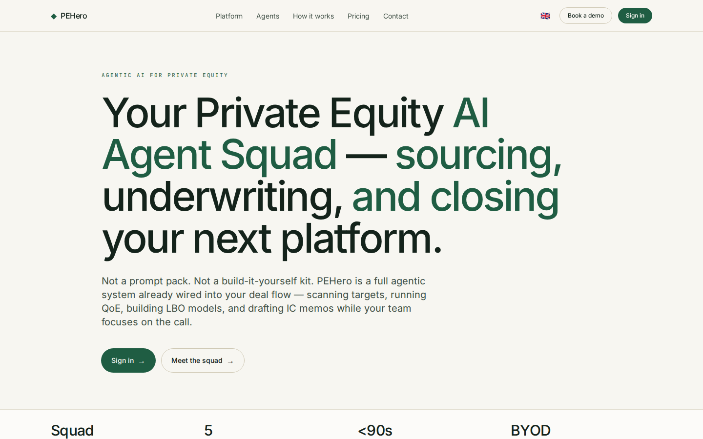
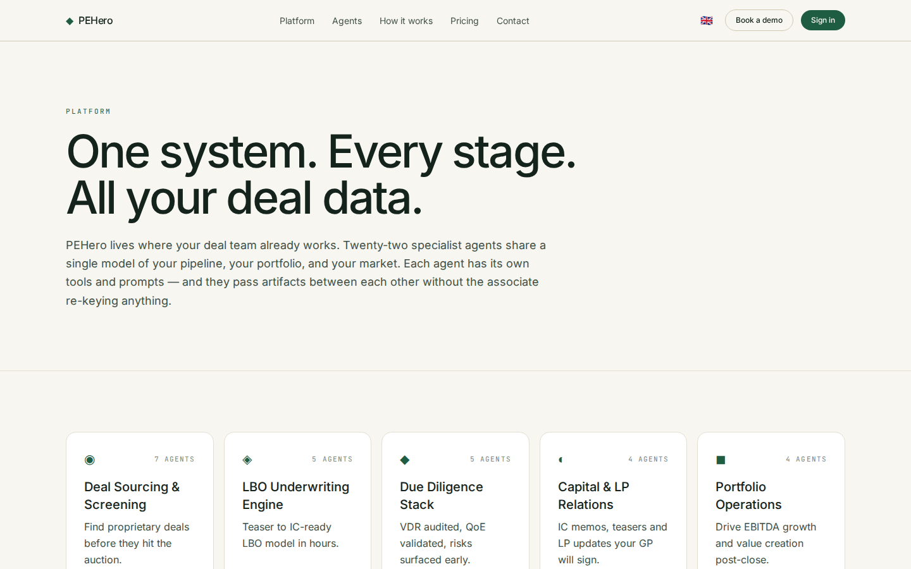

# FastPE Platform Guide

**Published:** 2026-08-19
**Platform:** [https://pehero.chat](https://pehero.chat)
**Source:** [github.com/predictivelabsai/FastPE](https://github.com/predictivelabsai/FastPE)

## Platform overview

Agentic AI for private equity — specialist agents that source, underwrite, close, and operate your deals.

This visual guide was reviewed against the live product using Playwright. Screens and available navigation can vary by account, role, and deployment configuration.

## 1. Your Private Equity AI Agent Squad — sourcing, underwriting, and closing your next platfor

AGENTIC AI FOR PRIVATE EQUITY Your Private Equity AI Agent Squad — sourcing, underwriting, and closing your next platform. Not a prompt pack. Not a build-it-yourself kit. PEHero is a full agentic system already wired into your deal flow — scanning targets, run

Screen reviewed at: [https://pehero.chat/](https://pehero.chat/)

## 2. One system. Every stage. All your deal data.

PLATFORM One system. Every stage. All your deal data. PEHero lives where your deal team already works. Twenty-two specialist agents share a single model of your pipeline, your portfolio, and your market. Each agent has its own tools and prompts — and they pass

Screen reviewed at: [https://pehero.chat/platform](https://pehero.chat/platform)

## Getting started

Visit [https://pehero.chat](https://pehero.chat) to explore FastPE. For source code and deployment details, use the GitHub link above.
