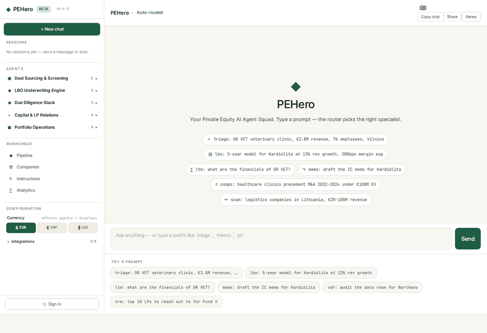

# PEHero User Guide

Your Private Equity AI Agent Squad — one chat interface, every PE workflow.

---

## Getting Started

1. **Open the app** at [pehero.fyi/app](https://pehero.fyi/app)
2. **Sign in** with your email (click the ◇ icon at the bottom of the left pane)
3. **Type a prompt** in the chat input — PEHero automatically routes to the right specialist agent

---

## Chat

The main interface is a 3-pane layout:

- **Left pane** — sessions, agent browser, workspace navigation, configuration
- **Centre pane** — the conversation with streaming responses, inline tables, and charts
- **Right pane** — live PE industry news feed (PE Hub, Buyouts Insider, PE International)

### Using Agents

PEHero has specialist agents across 5 PE workflow categories. You can invoke them in two ways:

1. **Prefix routing** — type a prefix like `triage:`, `lbo:`, `memo:` followed by your question
2. **Auto routing** — just describe what you need in plain English and the router picks the right agent

### Agent Categories

| Category | Agents | Example Prefix |
|----------|--------|----------------|
| **Sourcing** | Market Scanner, Deal Triage, Comp Finder, Owner Intent | `scan:`, `triage:`, `comps:` |
| **Underwriting** | LTM Normalizer, LBO Model Builder, Pro Forma, Debt Stack, Return Metrics | `ltm:`, `lbo:`, `pf:`, `debt:` |
| **Diligence** | VDR Auditor, Contract Abstractor, Legal & Regulatory, Ops DD, ESG Risk | `vdr:`, `contracts:`, `legal:` |
| **Capital** | IC Memo Writer, Deal Teaser, LP Update, Fundraising CRM, Outreach Email, LOI Writer | `memo:`, `teaser:`, `lp:`, `crm:`, `email:`, `loi:` |
| **Portfolio Ops** | Pricing Optimizer, EBITDA Variance, Value Creation, Customer Churn | `pricing:`, `opex:`, `vcb:`, `churn:` |

### Tables & Data

When agents return tabular data (financials, comps, models), the table appears inline in the chat with:

- **First 5 rows** shown by default — click **See more** to expand
- **Copy CSV** — copy the table to clipboard
- **Download CSV** — save as .csv file
- **Download XLS** — save as formatted .xlsx with styled headers
- **Visualize** — auto-generate a chart (bar, area, pie, treemap) from the table data

### Charts

Click **Visualize** on any table to render an interactive Plotly chart:

- Time series with <20 data points → **bar chart**
- Time series with 20+ points → **area/line chart**
- Categorical data ≤8 items → **pie chart**
- Categorical data >8 items → **treemap**
- Multiple numeric columns → **grouped bar chart**

### Memo & Document Export

For memo-type agents (IC Memo, Deal Teaser, LP Update, LOI, Outreach Email), three export buttons appear:

- **Preview PDF** — opens a formatted PDF in a new tab
- **Download PDF** — saves the PDF file
- **Download Word** — saves a formatted .docx with headings, tables, and bullets

---

## Pipeline

The pipeline kanban board shows all companies across deal stages:

**Sourced → Screened → LOI → Diligence → IC → Signed → Closed → Held → Exited**

- Filter by **sector** or **ownership** type
- Click any card to open the **deal workspace** with a brief on the right and per-deal chat in the centre
- Each card shows revenue, EBITDA, EV, multiple, and a seller-intent heat dot

---

## Company Search

Search your entire company database at `/app/companies`:

- **Fuzzy name search** — partial matching via ILIKE
- **Sector filter** — dropdown with all available sectors
- Results show revenue, EBITDA, employees, and deal stage
- Click any company to jump to its deal workspace

---

## Data Room

Upload and manage deal documents at `/app/dataroom`:

- Upload PDFs, Word docs, spreadsheets, presentations, and images
- Documents are stored securely and linked to your user account
- Download any uploaded file at any time
- Documents can be referenced by RAG-enabled agents for Q&A

---

## Analytics

Ask questions in plain English and get charts:

- "Top 10 companies by revenue"
- "Average EBITDA margin by sector"
- "Monthly revenue trend for DR VET"
- "Company count by deal stage"

The system translates your question to SQL, runs it read-only against the database, and picks the right chart type automatically. The underlying SQL query is shown for auditability.

---

## Instructions

Edit any agent's system prompt live at `/app/instructions`:

- Changes take effect on the very next conversation
- No restarts or deploys needed
- Perfect for encoding your firm's house style, memo format, or diligence approach
- Version history tracked for auditability

---

## News Feed

The right pane shows live PE industry news from:

- **PE Hub** — deals, exits, personnel moves
- **Buyouts Insider** — US mid-market PE, fundraising, LP allocations
- **PE International** — global PE, LP/GP dynamics

Plus financial headlines from FT, Bloomberg, WSJ, Reuters, BBC, ERR, and Baltic Times. Refreshed every 30 minutes (configurable).

---

## Configuration

### Currency

Switch between **EUR** (default), **GBP**, and **USD**. All monetary figures across the app follow your preference.

### Language

Five languages supported: English, Estonian, Lithuanian, Finnish, Swedish. The language selector is in the chat header — agents respond in your chosen language.

### Integrations

Baltic company registries (Estonia, Lithuania, Latvia) and web search (Tavily, EXA) status shown in the configuration panel.

---

## Keyboard Shortcuts

| Key | Action |
|-----|--------|
| **Enter** | Send message |
| **Shift+Enter** | New line in input |

---

## Data Coverage

| Country | Companies | Financial Rows | Source |
|---------|-----------|----------------|--------|
| Lithuania | 1,000 | 54,012 | rekvizitai.vz.lt |
| Estonia | 363 | 5,208 | ssb.ee |
| **Total** | **1,363** | **59,220** | |

Sectors: Healthcare, Software, Industrials, Financial Services, Business Services, Consumer.
